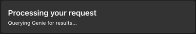

# Databricks Genie Bot

## Objective

This project implements an experimental chatbot that interacts with Databricks' Genie API. The bot is designed to 
facilitate conversations with Genie, Databricks' AI assistant, through a chat interface like MS Teams.

## Overview

This experimental code creates a Genie BOT in Databricks using the Genie API. It's important to note that this is not 
production-ready code and is not associated with or endorsed by any employer. 
The code is intended to be used as-is for experimental and learning purposes only.

## Key Features

- Integrates with Databricks' Genie API to start conversations and process follow-up messages
- Handles user queries and presents Genie's responses
- Manages conversation state for multiple users
- Formats and displays query results in a readable markdown table
- Handles clarification requests from Genie

## Implementation Details

The bot is built using:

- Python
- Bot Framework SDK
- aiohttp for asynchronous HTTP requests
- Databricks Genie Conversation API

The main components of the system are:

- A `GenieQuerier` class that handles the communication with the Genie API
- A `GenieResult` class that represents the results returned by Genie
- A `AdaptiveCard` class that formats the results into a user-friendly card format
- A `MyBot` class that processes incoming messages and manages user conversations
- An `aiohttp` web application that serves as the entry point for bot messages

## Disclaimer

This code is experimental that is not yet supported by Databricks. 
It should not be used in production environments and is provided strictly for educational and experimental purposes.

The code was tested in Azure Bot Framework that facilitates to integrate with any chatbot like MS Teams.

## Setup and Usage

### Configure your authentication mechanism
1. Go to [`src/const.py`](./src/const.py) and update `AUTH_METHOD` to one of either `oauth` or `service_principal`.

### Configure your Genie Spaces
1. Please update [spaces.json](./spaces.json) with your own Genie Space IDs in your workspace.
   1. Retrieve your Space ID from the Genie Space URL - see [docs here](https://learn.microsoft.com/en-us/azure/databricks/genie/conversation-api#-step-3-gather-details)

### Develop and test locally
1. Python version 3.12
2. Install the required dependencies listed in `requirements.txt`
3. Set up the necessary environment variables (`DATABRICKS_SPACE_ID`, `DATABRICKS_HOST`, etc.) in the `env.example` file, change the name to `.env`
4. Run the `app.py` script to start the bot
5. Test the bot with [Bot Framework Emulator](https://learn.microsoft.com/en-us/azure/bot-service/bot-service-debug-emulator?view=azure-bot-service-4.0&tabs=python)


### Deploy to Azure

1. Create App Service Plan
1. Create Web App on the App Service Plan
   1. Please use `PYTHON 3.12` when you select the python version
1. Add Configuration to the web app 
   1. Set startup command to be:

      ```gunicorn --bind 0.0.0.0 --worker-class aiohttp.worker.GunicornWebWorker --timeout 1200 --chdir src app:app```

   1. Set the necessary environment variables for authentication
      1. Always required:
         1. `DATABRICKS_HOST` (your Databricks Workspace URL)
         1. `APP_ID` (your [Azure Bot's App ID](https://docs.azure.cn/en-us/bot-service/bot-builder-authentication?view=azure-bot-service-4.0&tabs=userassigned%2Caadv2%2Ccsharp#to-get-your-app-or-tenant-id))
         1. `APP_PASSWORD` (your [Azure Bot's Secret](https://docs.azure.cn/en-us/bot-service/bot-builder-authentication?view=azure-bot-service-4.0&tabs=userassigned%2Caadv2%2Ccsharp#to-generate-a-new-password))
      1. If you want to use [Service Principal Authentication](https://learn.microsoft.com/en-us/azure/databricks/dev-tools/auth/oauth-m2m) (optional otherwise)
         1. `DATABRICKS_CLIENT_ID`
         1. `DATABRICKS_CLIENT_SECRET` 
   1. Set environment variable `SCM_DO_BUILD_DURING_DEPLOYMENT` to `true` to ensure the dependencies are installed during deployment.
1. Create Azure Bot. Add webapp endpoint details to Azure Bot: `<webapp-url>/api/messages`
   1. If you're going to use Oauth authentication, please refer to setup instructions [here](./databricks-oauth/readme.md)

## Screenshots




## Integrating with MS Teams

```mermaid
sequenceDiagram
    participant User
    participant Azure Portal
    participant GitHub
    participant Azure CLI
    participant VSCode
    participant Web App
    participant Bot Service
    participant Databricks
    participant Teams

    User->>GitHub: Clone DatabricksGenieBOT repository
    User->>Azure Portal: Create App Service Plan (Linux)
    User->>Azure Portal: Create Web App (Python 3.12)
    User->>Azure Portal: Create Azure Bot AI Service
    User->>Azure Portal: Configure Bot (Secret, Icon, Description)
    User->>Azure Portal: Configure Bot Messaging Endpoint
    User->>Azure Portal: Configure Bot Channel (Teams)
    User->>Databricks: Curate Genie Space and get Space ID
    User->>Databricks: Generate Token
    User->>Azure Portal: Configure Web App (Startup Command, Environment Variables)
    User->>VSCode: Open project folder
    User->>Azure CLI: Install Azure CLI
    User->>VSCode: Create and activate virtual environment
    User->>VSCode: Install requirements
    User->>Azure CLI: Login (az login)
    User->>Azure CLI: Deploy Web App (az webapp up)
    User->>Azure Portal: Configure Web App settings
    User->>Azure Portal: Test Bot in Web Chat
    User->>Teams: Test Bot in Microsoft Teams
